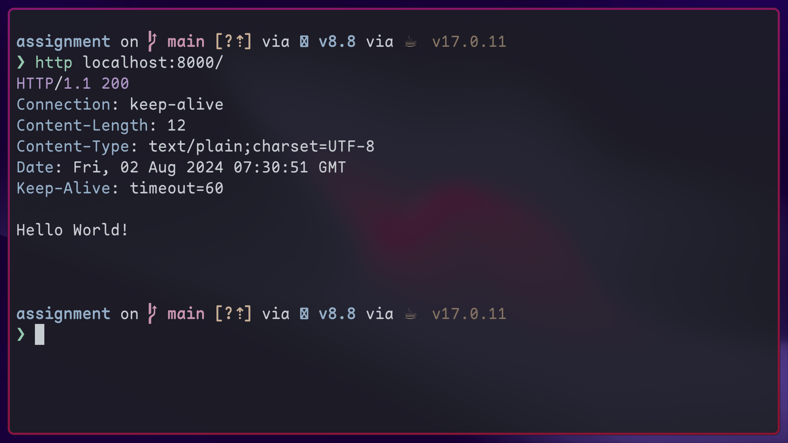

# Assignment

## Pre-requisites

- **Docker** - Docker & docker compose is used to start the postgresql at development server start
- **Java 17**

## Starting the server

> [!WARNING]
> Do NOT run the compose file manually

> [!WARNING]
> On MacOS and Linux `./gradlew` executes the `gradlew` executable in the current directory.
> On windows, use `gradlew.exe` executable instead

- To start the server, run `./gradlew bootRun` in the project directory
- Access the server through `localhost:8000` and should return "Hello World"

## API documentation

- Open API documentation is added to the project and Swagger UI can be accessed
  at `localhost:8000/swagger-ui/index.html`

## DB access

- Adminer (a light weight DB client) is already included in the compose
  to access the database. Simply navigate to `localhost:8888`

### Credentials

- System: PostgreSQL
- Server: db
- Username: admin
- Password: admin
- Database: assignment

## Testing

- To run the tests, run `./gradlew test`
- Test report can be accessed at `assignment/build/reports/tests/test/index.html`

## CI/CD

- Test & build jobs are ran on commit to `main` branch

